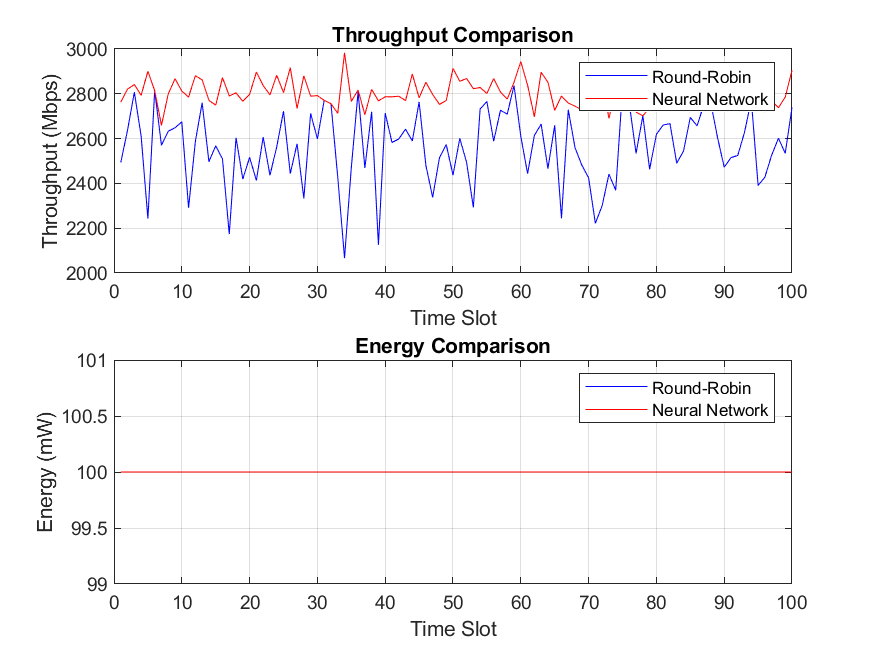

# Neural Network-Based Scheduling for 6G Multi-User Network

This project implements a neural network-based scheduling algorithm for a 6G multi-user network, optimizing resource allocation for improved throughput and energy efficiency. The system simulates a multi-user environment with Rayleigh fading channels and compares a neural network scheduler against a baseline Round-Robin scheduler. The project leverages MATLAB for simulation, training, and performance evaluation, focusing on key 6G network challenges such as dynamic channel conditions and resource constraints [1], [2].

## Research Context

Next-generation 6G networks demand efficient scheduling to maximize throughput and minimize energy consumption under dynamic channel conditions [1]. This project employs a neural network to learn optimal user scheduling based on channel gains, outperforming traditional Round-Robin scheduling [2]. The simulation incorporates realistic Rayleigh fading channels [3] and evaluates performance metrics like throughput gain and variance, aligning with 6G research goals for intelligent resource allocation [4].

## Features

- **Neural Network Scheduler**: Trained to optimize user scheduling based on channel gains.
- **Round-Robin Baseline**: Implements a fair, non-adaptive scheduling algorithm for comparison.
- **Rayleigh Fading Channels**: Simulates realistic wireless channel conditions [3].
- **Performance Metrics**: Computes throughput gain, average throughput, and throughput variance.
- **Visualization**: Plots throughput and energy consumption for both schedulers.
- **Reproducible Results**: Uses a fixed random seed for consistent simulations.

## Tech Stack

- **MATLAB**: Core environment for simulation, neural network training, and visualization.
- **MATLAB Neural Network Toolbox**: Used for training the scheduler.
- **MATLAB Plotting Functions**: Generates throughput and energy comparison plots.

## Project Structure

```plaintext
6g-ai-scheduler/
├── main.m             # Main script for simulation and scheduler evaluation
├── simulate_channel.m # Simulates Rayleigh fading channels
├── round_robin_scheduler.m # Round-Robin scheduling implementation
├── evaluate_schedulers.m   # Neural network scheduler evaluation
├── visualize_results.m     # Visualizes throughput and energy metrics
├── figures/               # Directory for output plots
├── README.md              # Project documentation
```

## Setup and Installation

### Prerequisites

- **MATLAB R2020a or later**: Required for Neural Network Toolbox compatibility.
- **MATLAB Neural Network Toolbox**: For training the neural scheduler.
- **Git**: For cloning the repository.

### Steps

1. **Clone the Repository**

   ```bash
   git clone https://github.com/your-username/6g-scheduler.git
   cd 6g-scheduler
   ```

2. **Set Up MATLAB**

   - Ensure MATLAB is installed with the Neural Network Toolbox.
   - Open MATLAB and navigate to the `6g-scheduler` directory.

### Running the Application

1. **Run the Main Script**

   In MATLAB, run:

   ```matlab
   main
   ```

   This executes the simulation, trains the neural network, evaluates both schedulers, and generates visualizations.

2. **Output**

   - **Console Output**: Displays throughput gain, average throughput (Gbps), and throughput variance (Mbps²) for both schedulers.
   - **Plots**: Saves throughput and energy comparison plots to `figures/throughput-comparison.png`.

## How It Works

1. **Channel Simulation**:

   - Generates Rayleigh fading channel gains for `numUsers` users across `numTimeSlots` using a random seed for reproducibility [3].
   - Parameters: `numUsers = 10`, `numTimeSlots = 100`.

2. **Neural Network Training**:

   - Trains a neural network with `numTrainingSamples = 1000` to predict optimal user scheduling based on channel gains.

3. **Scheduling**:

   - **Round-Robin Scheduler**: Assigns time slots cyclically to users, ignoring channel conditions.
   - **Neural Network Scheduler**: Selects users based on predicted scores from channel gains, maximizing throughput.

4. **Performance Evaluation**:

   - Computes throughput using Shannon's capacity formula: `bandwidth * log2(1 + SNR)` [2].
   - Calculates energy consumption (fixed at `txPower = 0.1 W`).
   - Reports throughput gain, average throughput, and variance.

5. **Visualization**:

   - Plots throughput (Mbps) and energy (mW) over time slots for both schedulers.

## Testing

Tests validate scheduler performance under simulated 6G network conditions. Key test cases include:

1. **Channel Simulation**:

   - Verify Rayleigh fading channel gains are non-negative and follow expected statistical properties.
   - **Output**: `channelGains` matrix (`numUsers x numTimeSlots`).

2. **Scheduler Comparison**:

   - Run `main.m` to compare Round-Robin and neural network schedulers.
   - **Screenshot**: Throughput and energy plots.
     

3. **Performance Metrics**:

   - Check console output for throughput gain, average throughput, and variance.
   - Example: `Throughput Gain: 25.43%`, `NN Avg Throughput: 1.82 Gbps`, `RR Avg Throughput: 1.45 Gbps`.

## Usage

- Run `main.m` in MATLAB to execute the full simulation.
- View console output for performance metrics.
- Check `figures/throughput-comparison.png` for visualized results.

## Future Improvements

- **Advanced Neural Architectures**: Explore deep learning models like LSTM for temporal channel dependencies [4].
- **Dynamic Power Allocation**: Incorporate variable transmit power for energy optimization.
- **Real-World Channel Models**: Integrate 6G-specific channel models (e.g., mmWave, terahertz) [1].
- **Scalability**: Increase `numUsers` and `numTimeSlots` for large-scale simulations.
- **Real-Time Evaluation**: Adapt for real-time 6G network testing.

## References

[1] Z. Zhang et al., “6G wireless networks: Vision, requirements, architecture, and key technologies,” _IEEE Veh. Technol. Mag._, vol. 14, no. 3, pp. 28–41, Sep. 2019, doi: 10.1109/MVT.2019.2921397.

[2] T. M. Cover and J. A. Thomas, _Elements of Information Theory_, 2nd ed. Hoboken, NJ: Wiley, 2006.

[3] G. L. Stuber, _Principles of Mobile Communication_, 4th ed. Springer, 2017.

[4] H. Yang et al., “Deep learning-based resource allocation for 6G wireless networks,” _IEEE Netw._, vol. 34, no. 5, pp. 186–193, Sep./Oct. 2020, doi: 10.1109/MNET.011.2000132.
