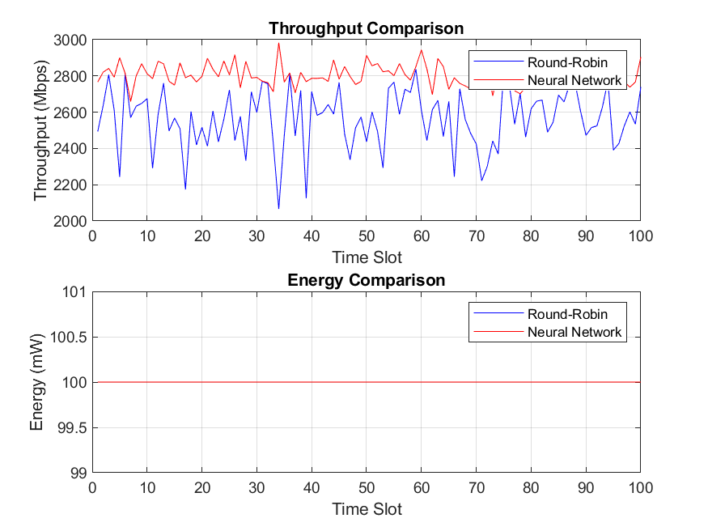

# Neural Network-Based Scheduling for 6G Multi-User Networks

A learned scheduler for a multi-user wireless downlink, compared against a Round-Robin baseline under Rayleigh fading. Built in MATLAB.

## What it does

```
Simulate Rayleigh-fading channel gains (10 users, 100 time slots)
  -> Round-Robin scheduler (baseline, ignores channel state)
  -> Neural network scheduler (predicts the best user per slot from channel gains)
  -> Compare throughput and throughput variance
```

The neural scheduler is trained to imitate the argmax rule: given a snapshot of every user's instantaneous channel gain, pick the user with the strongest channel. That's the classical "multiuser diversity" scheduling policy (Tse & Viswanath, *Fundamentals of Wireless Communication*, Ch. 6) — the throughput-maximizing choice when there's no fairness constraint, because a fading channel is, at any given instant, very likely to be strong for at least one of several independent users.

## Results

From an actual run of `main.m` (`rng(42)` for reproducibility).

| | Round-Robin | Neural Network |
|---|---|---|
| Avg. throughput | 2.56 Gbps | 2.80 Gbps |
| Throughput variance | 26,515 Mbps² | 3,667 Mbps² |

Throughput gain: 9.36%. The bigger effect is the variance: the neural scheduler's throughput is over 7x more consistent slot-to-slot than Round-Robin's. Round-Robin ignores channel state entirely, so it sometimes schedules a user mid-fade (a bad slot) and sometimes a user with a strong channel (a good slot); a channel-aware scheduler avoids the bad slots by construction. For a metric like 6G's targeted ultra-reliable low-latency communication (URLLC), that consistency arguably matters as much as the average gain.



Energy is identical for both schedulers (a fixed 0.1 W transmission-power model; see Limitations).

## Why a neural network, here

Worth being direct about this: the policy being learned (argmax of instantaneous channel gain) has a closed form and doesn't strictly need a neural network to compute. This project demonstrates the learning-based approach on a case simple enough to verify against a known-correct baseline before applying it somewhere the correct answer isn't obvious in closed form — see Roadmap.

## Roadmap

- **Proportional-fair scheduling.** Pure max-throughput scheduling (what this project implements) is provably unfair: users with a persistently weak channel starve. Proportional-fair scheduling (rate normalized by a user's own recent average rate, rather than raw instantaneous rate) is the standard way to balance throughput against fairness, and — unlike pure argmax — doesn't have a trivial closed-form solution once fairness history is involved, which is where a learned scheduler would have a real argument for outperforming a hand-coded rule.
- **Deep reinforcement learning.** Current research increasingly frames scheduling as a sequential decision problem (an MDP over channel/queue state), trained with DRL rather than supervised imitation of a fixed target label.
- **Multi-domain scheduling**: extending beyond per-slot user selection to joint time/frequency/spatial (MU-MIMO) resource allocation, relevant to real 5G/6G schedulers.

## Project structure

```
6g-ai-scheduler/
├── main.m                     # Entry point: runs the full simulation and comparison
├── src/
│   ├── simulate_channel.m     # Rayleigh fading channel-gain generator
│   ├── train_neural_scheduler.m  # Trains a classifier to predict the best user per slot
│   ├── round_robin_scheduler.m   # Baseline: fixed cyclic user order
│   ├── evaluate_schedulers.m     # Runs the trained scheduler over all time slots
│   └── visualize_results.m       # Generates figures/throughput-comparison.png
├── tests/
│   └── testSchedulerPipeline.m   # MATLAB unit tests (matlab.unittest)
├── figures/
├── docs/
│   └── Summary.pptx            # Slide summary
└── LICENSE
```

## Requirements

- MATLAB R2020a or newer
- Deep Learning Toolbox
- Statistics and Machine Learning Toolbox

## Running

```matlab
run('main.m')
```

`main.m` adds `src/` to the path itself, so this works regardless of your current MATLAB folder.

## Testing

```matlab
addpath('src');
results = runtests('tests');
disp(results);
```

Covers channel generation, the round-robin baseline against the exact Shannon-capacity formula it's supposed to implement, the neural scheduler producing a working, callable model, and a sanity check that it picks the obviously-correct user when one channel is far stronger than the rest.

## Limitations

- Energy uses a fixed transmit-power model (0.1 W regardless of scheduling decision); it doesn't yet model adaptive power control.
- The learned policy is throughput-optimal but not fairness-aware — see Roadmap.
- Single-cell, single-antenna-per-user model; no interference, no MIMO/beamforming.
- Evaluated on synthetic Rayleigh-fading channels, not measured or standardized (e.g. 3GPP) channel traces.

## References

[1] Z. Zhang et al., "6G wireless networks: Vision, requirements, architecture, and key technologies," IEEE Veh. Technol. Mag., vol. 14, no. 3, 2019.

[2] T. Cover, J. Thomas, *Elements of Information Theory*, 2nd ed., Wiley, 2006.

[3] D. Tse, P. Viswanath, *Fundamentals of Wireless Communication*, Cambridge University Press, 2005.

[4] G. L. Stuber, *Principles of Mobile Communication*, 4th ed., Springer, 2017.

[5] H. Yang et al., "Deep learning-based resource allocation for 6G," IEEE Netw., vol. 34, no. 5, 2020.

## License

MIT, see [LICENSE](LICENSE).
